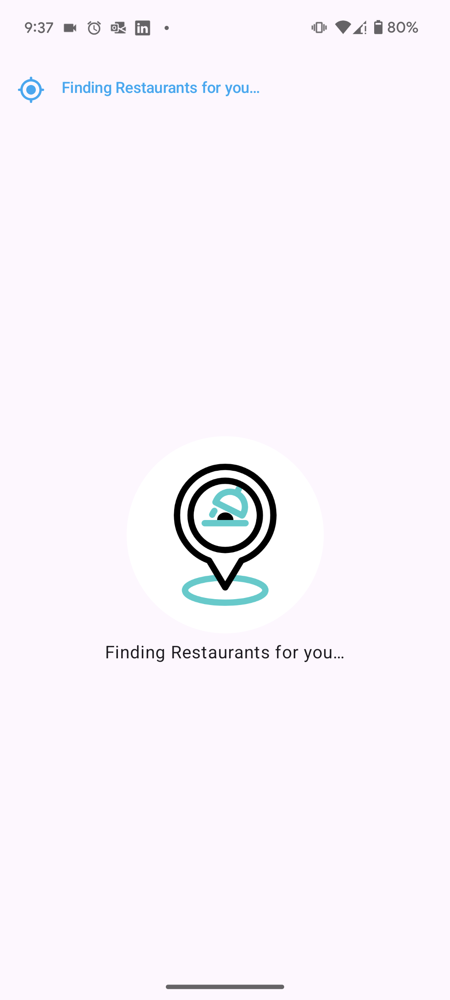
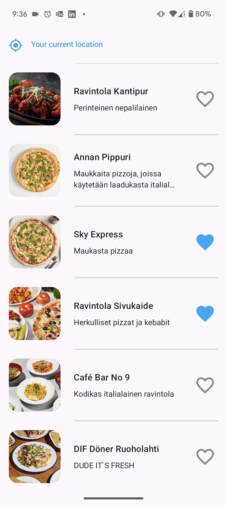

### Core Features

1. **Dynamic Venue List**:
    - Displays up to **15 venues** near the user's current location.
    - Updates every **10 seconds** as the user's location changes.
    - Loops through the provided location list.

2. **Favorites Management**:
    - Users can toggle venues as **favorites** using a heart icon.
    - Favorite states are persisted across app restarts.

3. **Handling of no internet connection**
4. **API Integration**:
    - Data fetched from the Wolt API:  
      `https://restaurant-api.wolt.com/v1/pages/restaurants?lat=60.170187&lon=24.930599`
    - Utilizes key fields like venue name, description, image, and id.

## App screenshots

  
  
  

## Tech Stack

- **Programming Language**: Kotlin
- **UI Framework**: Jetpack Compose
- **Networking**: Ktor
- **Local Database**: Room
- **Dependency Injection**: Hilt
- **State Management**: StateFlow 

